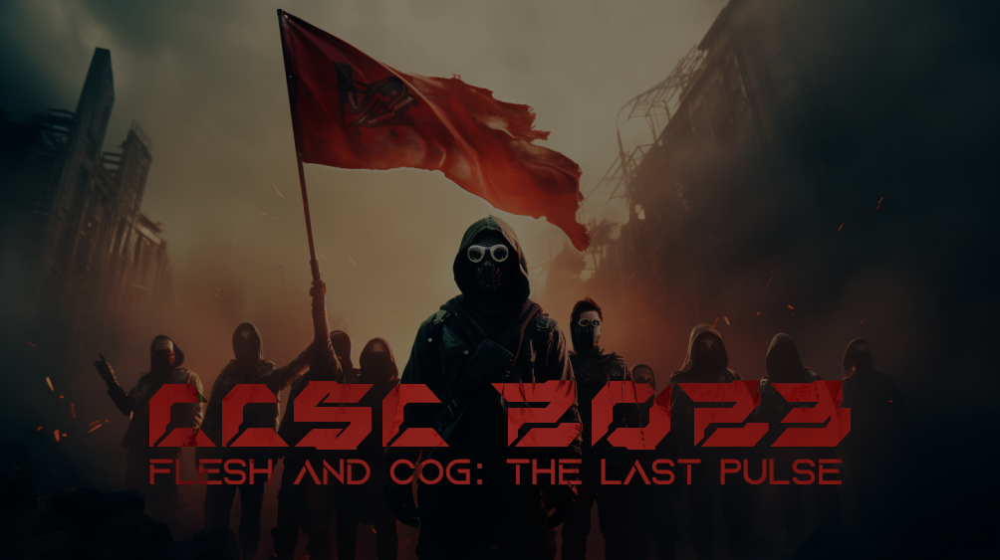

# Cyprus Cyber Security Challenge CTF 2023

**Dates:** 01/07/2023 - 16/07/2023

## Repository Structure
This is the official repository with the challenges published in Cyprus Cyber Security Challenge (CCSC) CTF 2023. Each challenge has a public, solution and setup folder (if applicable) and is accompanied with a short description. The setup folder contains all the files required to build and host the challenge and usually contains the flag and a proof of concept solution as well. The public folder contains the files that are released to the participant during the competition.

## Dependencies
Although some of the challenges may run as is, it is recommended that you have docker and docker-compose installed and use the provided scripts to run the challenges to ensure isolation and therefore proper environment setup.

## Challenges

### crypto

| Name | Author |
| ---- | ------ |
| [AI's Pizza](./crypto/ai-pizza) | feltf |
| [Caesar Salad](./crypto/caesar-salad) | feltf |
| [Ciphered Protocol Assault](./crypto/ciphered-protocol-assault) | rok0s |
| [Leonhard's position model](./crypto/leonhards-position-model) | tratrafe2 |
| [Little Shakalaka](./crypto/little-shakalaka) | feltf |
| [Mind Your As and Is](./crypto/mind-your-a-and-i) | feltf |
| [rsAI](./crypto/rsai) | feltf |
| [Secure Timer](./crypto/secure-timer) | feltf |

### forensics

| Name | Author |
| ---- | ------ |
| [AI in the Middle](./forensics/AIitm) | s3nn |
| [AI Retaliation](./forensics/ai-retaliation) | R3D |
| [Colors](./forensics/colors) | R3D |
| [Is Beedof real?](./forensics/is-beedof-real) | icyDux |
| [Not safe](./forensics/not-safe) | icyDux |
| [Unraveling the Frame: Seeking the Start of Flag (SOF).jpg](./forensics/unraveling-the-frame) | R3D |
| [Unveiling the Quacks](./forensics/unveiling-the-quacks) | s1kk1s |

### misc

| Name | Author |
| ---- | ------ |
| [ASMr - Whisper](./misc/asmr) | R3D |
| [Cyber Prison 1 - Codebreakers' Gauntlet](./misc/cyber-prison-1) | R3D |
| [Cyber Prison 2 - Echoes of Rebellion](./misc/cyber-prison-2) | R3D |
| [PyJail Disbelief](./misc/pyjail-disbelief) | rok0s |

### pwn

| Name | Author |
| ---- | ------ |
| [Attack the Core](./pwn/attack-the-core) | s3nn |
| [babyrop](./pwn/babyrop) | s3nn |
| [Bag of Tricks](./pwn/bag-of-tricks) | condiom / s3nn |
| [Get to the CHOPper!](./pwn/get-to-the-chopper) | neo |
| [Get to the CHOPper! Part 2](./pwn/get-to-the-chopper-2) | neo |
| [ROP: Restrictions Of Pickles](./pwn/restrictions-of-pickles) | neo |
| [Stack Smashing in 2023](./pwn/stack-smashing-2023) | s3nn |

### reverse

| Name | Author |
| ---- | ------ |
| [Control-it](./reverse/control-it) | icyDux |
| [Electroverse: Decrypting the Digital Pulse](./reverse/electroverse) | s1kk1s |
| [excepcionalismo: Order through chaos](./reverse/excepcionalismo) | 0xishtar |
| [Intellectual Conflict](./reverse/intellectual-conflict) | 0xishtar |
| [Login Module](./reverse/login-module) | R3D |
| [Shellhunting](./reverse/shellhunting) | icyDux |

### web

| Name | Author |
| ---- | ------ |
| [Cookie Conquest](./web/cookie-conquest) | sAINT_barber |
| [Cyber Sleuths: Web Security Havoc](./web/cyber-sleuths-web-security-havoc) | sAINT_barber |
| [Forgotten Classes](./web/forgotten-classes) | sAINT_barber |
| [Guardians' RPC Rift](./web/guardians-rpc-rift) | kotsios |
| [Mission SerializAItion](./web/mission-serializaition) | s3nn + Koupepi |
| [Secret Prompt](./web/secret-prompt) | koks |
| [Stop the Robots](./web/stop-the-robots) | sAINT_barber |
| [Taskmaster's Turmoil](./web/taskmasters-turmoil) | sAINT_barber |
| [Zenon](./web/zenon) | rok0s |

