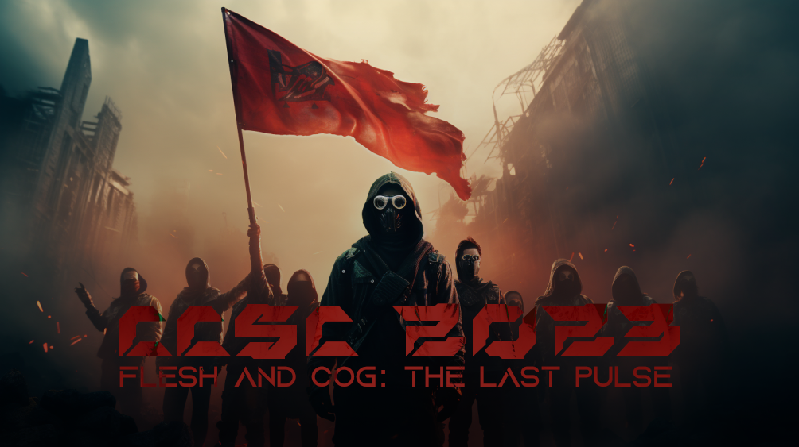

# Cyprus Cyber Security Challenge CTF 2023

**Dates:** 01/07/2023 - 16/07/2023

## Repository Structure
This is the official repository with the challenges published in Cyprus Cyber Security Challenge (CCSC) CTF 2023. Each challenge has a public, solution and setup folder (if applicable) and is accompanied with a short description. The setup folder contains all the files required to build and host the challenge and usually contains the flag and a proof of concept solution as well. The public folder contains the files that are released to the participant during the competition.

## Dependencies
Although some of the challenges may run as is, it is recommended that you have docker and docker-compose installed and use the provided scripts to run the challenges to ensure isolation and therefore proper environment setup.

## Challenges

### crypto

| Name | Author |
| ---- | ------ |
| [AI's Pizza](crypto/AI's Pizza) | feltf || [Caesar Salad](crypto/Caesar Salad) | feltf || [Ciphered Protocol Assault](crypto/Ciphered Protocol Assault) | rok0s || [Leonhard's position model](crypto/Leonhard's position model) | tratrafe2 || [Little Shakalaka](crypto/Little Shakalaka) | feltf || [Mind Your As and Is](crypto/Mind Your As and Is) | feltf || [rsAI](crypto/rsAI) | feltf || [Secure Timer](crypto/Secure Timer) | feltf |

### forensics

| Name | Author |
| ---- | ------ |
| [AI in the Middle](forensics/AI in the Middle) | s3nn || [AI Retaliation](forensics/AI Retaliation) | R3D || [Colors](forensics/Colors) | R3D || [Is Beedof real?](forensics/Is Beedof real?) | icyDux || [Not safe](forensics/Not safe) | icyDux || [Unraveling the Frame: Seeking the Start of Flag (SOF).jpg](forensics/Unraveling the Frame: Seeking the Start of Flag (SOF).jpg) | R3D || [Unveiling the Quacks](forensics/Unveiling the Quacks) | s1kk1s |

### misc

| Name | Author |
| ---- | ------ |
| [ASMr - Whisper](misc/ASMr - Whisper) | R3D || [Cyber Prison 1 - Codebreakers' Gauntlet](misc/Cyber Prison 1 - Codebreakers' Gauntlet) | R3D || [Cyber Prison 2 - Echoes of Rebellion](misc/Cyber Prison 2 - Echoes of Rebellion) | R3D || [PyJail Disbelief](misc/PyJail Disbelief) | rok0s |

### pwn

| Name | Author |
| ---- | ------ |
| [Attack the Core](pwn/Attack the Core) | s3nn || [babyrop](pwn/babyrop) | s3nn || [Bag of Tricks](pwn/Bag of Tricks) | condiom / s3nn || [Get to the CHOPper!](pwn/Get to the CHOPper!) | neo || [Get to the CHOPper! Part 2](pwn/Get to the CHOPper! Part 2) | neo || [ROP: Restrictions Of Pickles](pwn/ROP: Restrictions Of Pickles) | neo || [Stack Smashing in 2023](pwn/Stack Smashing in 2023) | s3nn |

### reverse

| Name | Author |
| ---- | ------ |
| [Control-it](reverse/Control-it) | icyDux || [Electroverse: Decrypting the Digital Pulse](reverse/Electroverse: Decrypting the Digital Pulse) | s1kk1s || [excepcionalismo: Order through chaos](reverse/excepcionalismo: Order through chaos) | 0xishtar || [Intellectual Conflict](reverse/Intellectual Conflict) | 0xishtar || [Login Module](reverse/Login Module) | R3D || [Shellhunting](reverse/Shellhunting) | icyDux |

### web

| Name | Author |
| ---- | ------ |
| [Cookie Conquest](web/Cookie Conquest) | sAINT_barber || [Cyber Sleuths: Web Security Havoc](web/Cyber Sleuths: Web Security Havoc) | sAINT_barber || [Forgotten Classes](web/Forgotten Classes) | sAINT_barber || [Guardians' RPC Rift](web/Guardians' RPC Rift) | kotsios || [Mission SerializAItion](web/Mission SerializAItion) | s3nn + Koupepi || [Secret Prompt](web/Secret Prompt) | koks || [Stop the Robots](web/Stop the Robots) | sAINT_barber || [Taskmaster's Turmoil](web/Taskmaster's Turmoil) | sAINT_barber || [Zenon](web/Zenon) | rok0s |

